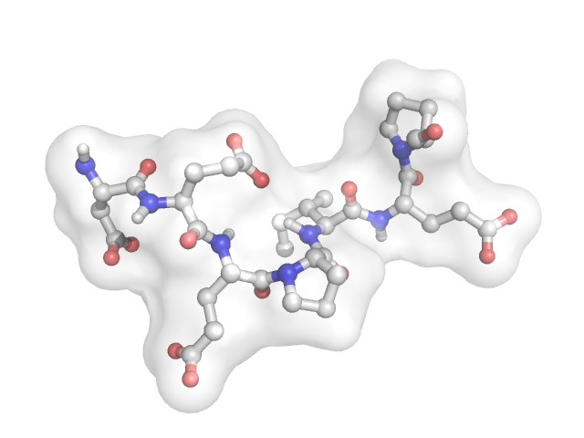

# DeepIEP: Isoelectric Point (IEP/pI) of peptides using Recurrent Neural Networks (RNNs)



DeepIEP is a data-driven model of the isoelectric point of denatured peptides. It predicts based on a recurrent neural network that was trained on a dataset of peptides with literature pI values associated. The recurrent neural network reads the peptide in standard one letter notation, one letter at a time, and at the end of reading, outputs the predicted pI.
    In this version it can predict peptides up to 49 letters long because it runs in batch mode, but the weights could be transferred to a stateful model and used to predict longer sequences. 
    It supports a single modification, cyscam, of cysteines, either by setting a switch on the model, or substituting cysteines "C" with "Z" before prediction.

## Installation

The program is a simple python file, with an accompanying Models directory with a default model. It's possible to save these in the work directory and call them from a Jupyter notebook or ipython session. It has on purpose been kept simple and comes without a fancy installer.

## Usage as a model

DeepIEP is programmed as a simple object that can load the Keras model and accompanying charset


```python
from DeepIEP import DeepIEP
deepiep = DeepIEP()
```

    Using TensorFlow backend.


```python
print deepiep.modelname
print "".join(deepiep.char2idx.keys())
print deepiep.max_length
print deepiep.model.summary()
```

    Models/default
    ACEDGFIHKMLNQPSRTWVYXZ
    49
    _________________________________________________________________
    Layer (type)                 Output Shape              Param #   
    =================================================================
    input_68 (InputLayer)        (None, 50, 23)            0         
    _________________________________________________________________
    lstm_68 (LSTM)               [(None, 200), (None, 200) 179200    
    _________________________________________________________________
    dense_135 (Dense)            (None, 180)               36180     
    _________________________________________________________________
    dense_136 (Dense)            (None, 1)                 181       
    =================================================================
    Total params: 215,561
    Trainable params: 215,561
    Non-trainable params: 0
    _________________________________________________________________
    None


The model takes the default amino acid characters and can use the .predict function to predict from either a string or a list like object with strings (python lists, numpy arrays, pandas)


```python
deepiep.predict("ICECREAM")
```


    3.8045497


```python
l = ["FATCAT", "ICECREAM"]
print deepiep.predict(l)
```

    [[ 5.2911725 ]
     [ 3.80454946]]


No particular error handling has been programmed, if you feed it something it doesn't expect, it will fail


```python
deepiep.predict(0)
```


    ---------------------------------------------------------------------------

    TypeError                                 Traceback (most recent call last)

    <ipython-input-9-033b22985a9a> in <module>()
    ----> 1 deepiep.predict(0)
    

    /home/esben/git/DeepIEP/DeepIEP.py in predict(self, seq)
         34         else:
         35             #print "list like"
    ---> 36             return self.predict_list(seq)
         37 
         38     def predict_seq(self, seq):


    /home/esben/git/DeepIEP/DeepIEP.py in predict_list(self, a)
         45     def predict_list(self, a):
         46         v = []
    ---> 47         for s in a:
         48             if self.cyscam:
         49                 s = s.replace("C","Z")


    TypeError: 'int' object is not iterable


Apart from the standard aminoacids, the default model has been trained with "X" as unknown, and "Z" as cyscam modified cysteines. If the peptide(s) is treated with iodoacetamide the cyscam toogle can be set to True for automatic conversion


```python
print "Predictions with C modification"
deepiep.cyscam = True
print deepiep.predict(l)
print "Predictions without C modification"
deepiep.cyscam = False
print deepiep.predict(l)
```

    Predictions with C modification
    [[ 5.46634293]
     [ 4.46484089]]
    Predictions without C modification
    [[ 5.2911725 ]
     [ 3.80454946]]


## Usage from the command line
The DeepIEP.py script can also be used from the command line

```bash
python DeepIEP.py -h

usage: DeepIEP.py [-h] [--sequence [SEQUENCE [SEQUENCE ...]]] [--file FILE]
                  [--full_precision]

DeepIEP: Prediction of isoelectric point (pI/IEP) using recurrent neural
networks(RNNs)

optional arguments:
  -h, --help            show this help message and exit
  --sequence [SEQUENCE [SEQUENCE ...]], -s [SEQUENCE [SEQUENCE ...]]
                        An uppercase amino acid sequence to predict (Z= cyscam
                        modified C, X=unknown
  --file FILE, -f FILE  A CSV file with sequences to predict. Sequences must
                        be in a column named "Sequences"
  --full_precision      If full precision should be used when writing a CSV
                        file
```

One or more sequences can be specified from the command line
                                                                     
```bash
python DeepIEP.py -s FATCAT ICECREAM
                                                                     
FATCAT 5.3
ICECREAM 3.8
                                                                     
```

Alternatively a csv file with the sequences can be used. The column with the sequences must be named "Sequences" and a column named DeepIEP will be appended/overwritten

```bash
python DeepIEP.py -f mysequences.csv
```

<div class="alert alert-success">
<b>NOTICE</b>
The default is to save the csv file with a single decimal. This will also affect other columns. If this is unwanted, the --full_precision switch can be used.
</div>

## Reference
Bjerrum, E.J., 2017. DeepIEP: a Peptide Sequence Model of Isoelectric Point (IEP/pI) using Recurrent Neural Networks (RNNs). arXiv preprint [arXiv:1712.09553](https://arxiv.org/abs/1712.09553).

### bibtex
```bibtex
@article{bjerrum2017deepiep,
  title={DeepIEP: a Peptide Sequence Model of Isoelectric Point (IEP/pI) using Recurrent Neural Networks (RNNs)},
  author={Bjerrum, Esben Jannik},
  journal={arXiv preprint arXiv:1712.09553},
  year={2017}
}
```

## Commercial Support

Commercial support is available from [Wildcard Pharmaceutical Consulting](https://www.wildcardconsulting.dk)


```python

```
